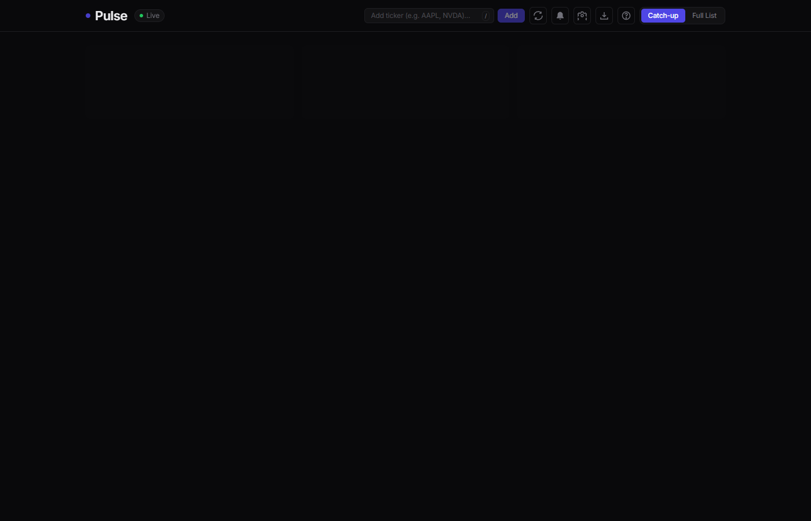
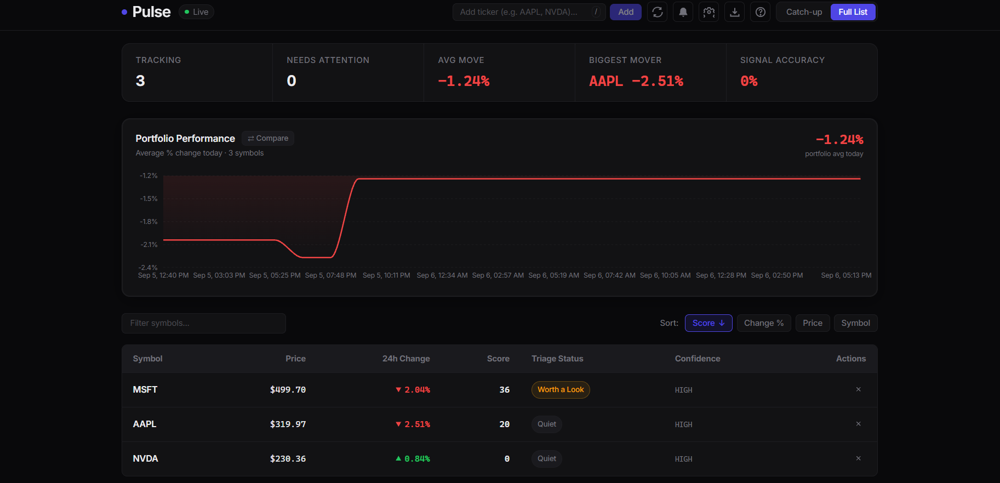
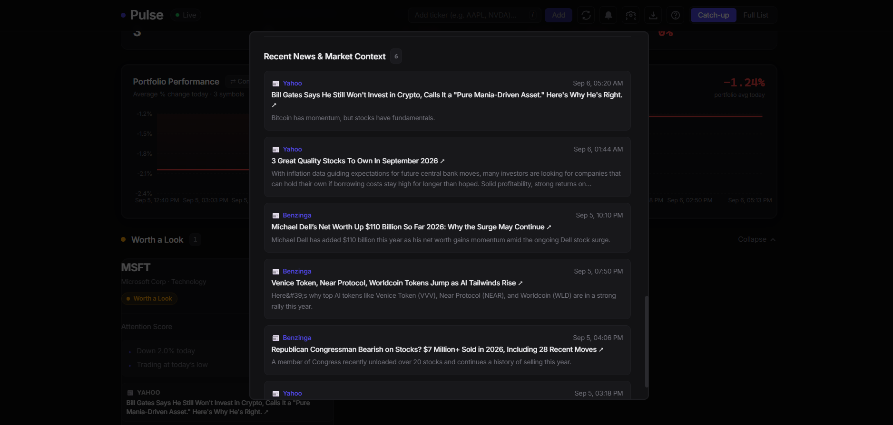
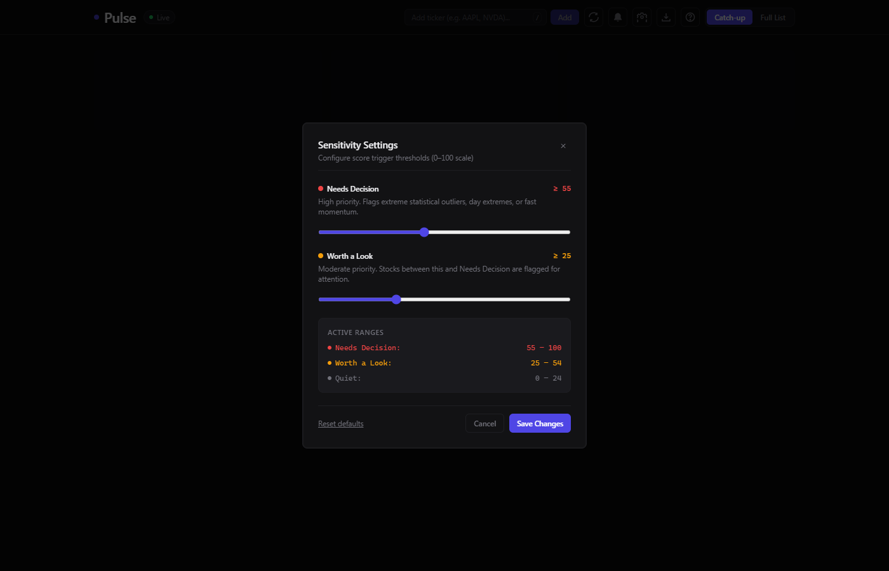
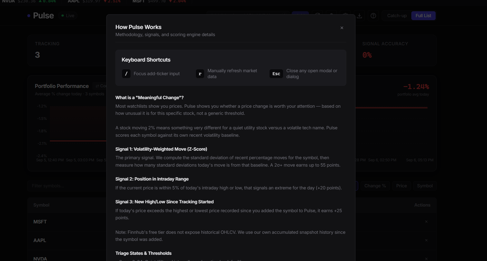

# Pulse — Smart Market Watchlist


Built for **Code, by Groww (2026)**.

## What this is

Most watchlists show you prices. Pulse instead answers "what actually deserves my attention right now, and why" — the default screen is a **catch-up triage** (needs a decision / worth a look / nothing to do), not a flat table of tickers.

## Screenshots


*Triage view — stocks sorted into Needs a Decision / Worth a Look / Nothing to Do*


*Full sortable, filterable table view with attention scores and confidence levels*


*Every flagged move is paired with real news context, not just a number*


*User-adjustable triage thresholds, applied live across the whole app*


*In-app methodology explainer — full transparency on how "meaningful change" is calculated*

## Key Features

- **Triage Decision Engine:** Categorizes watched symbols based on meaningful volatility, deviation from historical moving averages, and local highs/lows (`backend/lib/scoring.js`).
- **Market Open/Closed Status Indicator:** Real-time US equity market status (NYSE/NASDAQ 9:30 AM – 4:00 PM ET) informing users when prices reflect previous close vs live trading.
- **Portfolio Performance & Compare Mode:** Aggregate % change tracking across your portfolio with interactive multi-symbol normalized overlay comparison.
- **Sector Context & Company News:** Finnhub company profile and live headline context integrated directly into cards and detail views.
- **Correlated Co-Movement Detection:** Identifies market-wide co-movement to distinguish idiosyncratic events from broad index swings.
- **Adjustable Sensitivity Settings:** Custom thresholds for triage triggers with live sync to the background evaluation engine.
- **Keyboard Shortcuts:** Fast workflows (`N` to add stock, `?` for shortcut help, `Esc` to dismiss modals).
- **Dark, Cohesive Design System:** Modern typography (Inter), glassmorphic surfaces, animated score gauges, and responsive data tables.

## Architecture

- **Frontend:** React + Vite + Tailwind CSS
- **Backend:** Node.js / Express
- **Database:** Postgres via Supabase, used as an **append-only event store** for price history — every poll writes a new snapshot row rather than overwriting a "current price" field, making "what changed since I last looked" an accurate query.
- **Market data:** Finnhub API (free tier, cached & rate-limit protected)
- **Background worker:** In-process poller (`backend/lib/worker.js`) that periodically fetches quotes, writes history snapshots, and logs `change_events` when thresholds are crossed.

## Setup

### 1. Database

In your Supabase project → **SQL Editor**, run the entire content of `backend/schema.sql`.
*(Note: `schema.sql` automatically creates all required tables, indexes, triggers, and disables Row Level Security (RLS) so the single-user demo backend can read/write without auth tokens).*

### 2. Backend

```bash
cd backend
npm install
cp .env.example .env
```

Fill in `backend/.env` with your credentials:
```env
SUPABASE_URL=your_supabase_project_url
SUPABASE_ANON_KEY=your_supabase_anon_key
FINNHUB_API_KEY=your_finnhub_api_key
POLL_INTERVAL_MS=60000
PORT=3001
```

Start the backend:
```bash
npm start
```
You should see `Backend running on http://localhost:3001` and background price poller logs.

### 3. Frontend

```bash
cd frontend
npm install
npm run dev
```

Open the printed local URL (default: `http://localhost:5173`).

## Known Scoping Decisions

- **Single demo user bootstrap:** A single demo user is automatically created on startup (`backend/lib/supabaseClient.js`). Every table and query already keys off `user_id`, making full auth integration straightforward.
- **True 52-week data vs accumulated history:** Finnhub's free tier doesn't expose 52-week highs/lows. "Meaningful change" is computed from available live quotes and accumulated snapshot history.
- **In-process worker:** Ingestion runs within the backend process for simplicity at demo scale.
- **Multi-device sync:** Uses timestamped snapshots; future extensions can use CRDTs or last-write-wins merging.

## Folder Structure

```
backend/
  index.js              Server entry point and routes mounting
  lib/
    marketData.js        Finnhub API integration with node-cache & exponential backoff
    marketHours.js       US market hours & trading session calculator
    scoring.js           Meaningful-change attention scoring engine
    settingsStore.js     User sensitivity threshold store
    supabaseClient.js    Supabase client and demo user bootstrap
    worker.js            Background price poller & correlated-move detector
  routes/
    watchlist.js         Watchlist CRUD, stats, and catchup endpoints
    stocks.js            History, detail, news, and profile endpoints
    settings.js          User alert sensitivity configuration
  schema.sql             Database schema and table definitions

frontend/
  src/
    App.jsx              Main dashboard layout and navigation
    api.js               Centralized API client
    index.css            Tailwind design tokens and animations
    components/
      CatchupView.jsx     Triage decision grid
      WatchlistTable.jsx  Full sortable/searchable watchlist table
      StockCard.jsx       Individual stock card with gauge and news
      StockDetail.jsx     Interactive stock history and news modal
      PortfolioChart.jsx  Portfolio performance and compare mode chart
      ScoreGauge.jsx      Attention score radial gauge
      StatsBar.jsx        Portfolio-level stats strip
      SettingsModal.jsx   Sensitivity threshold settings
      HelpModal.jsx       Keyboard shortcuts and usage guide
      AddStockForm.jsx    Stock addition input with quick tags
      ConfirmModal.jsx    Removal confirmation modal
      TickerTape.jsx      Top-of-page price ribbon
      Toast.jsx           Notification toasts
      Sparkline.jsx       Mini price trend chart
      Skeleton.jsx        Loading placeholders
```
